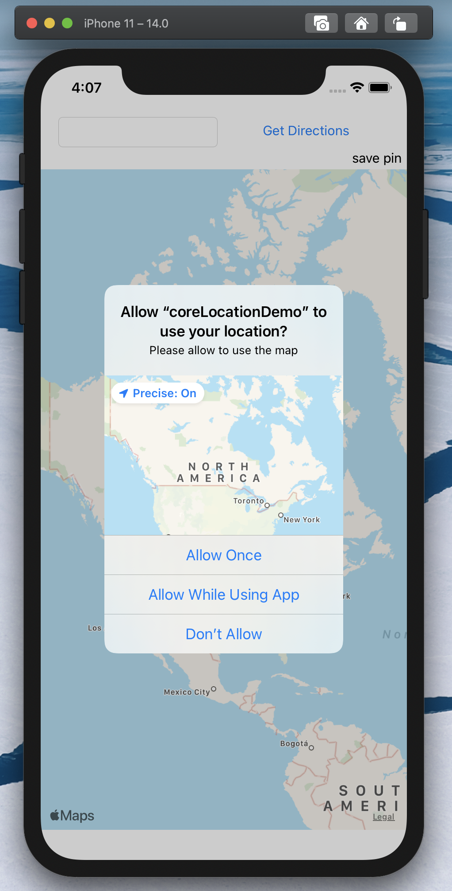
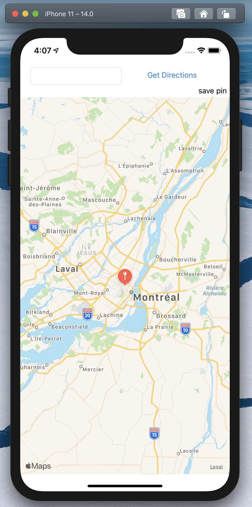
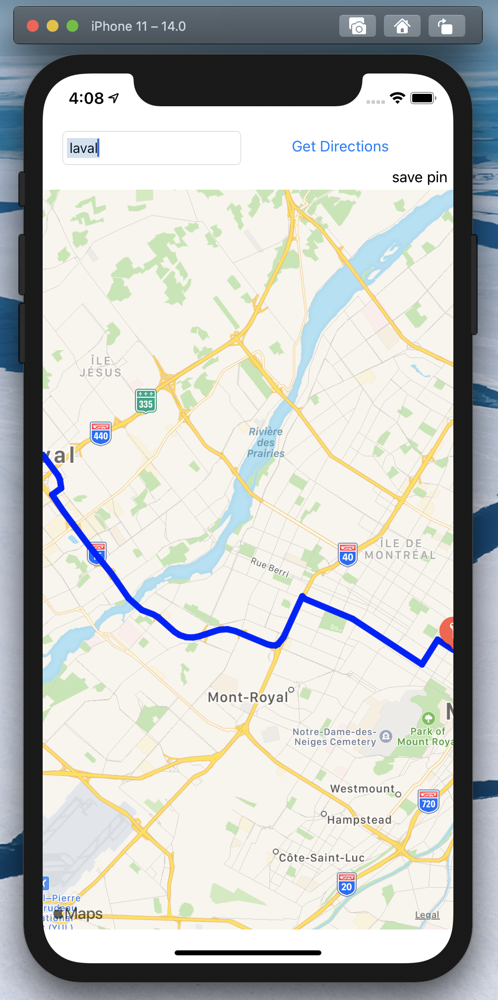

# My Locations

It'a a small app for iOS written in swift. Make use of CoreLocation framework for the geolocatization features and use CoreData to store a location persinstently in the database.

Features:
- Ask for pemission to use GPS sensors
- Geolocate you position based on the GPS sensor
- Get direction to a specific destination from your current location
- Save a pin(location) to the database

